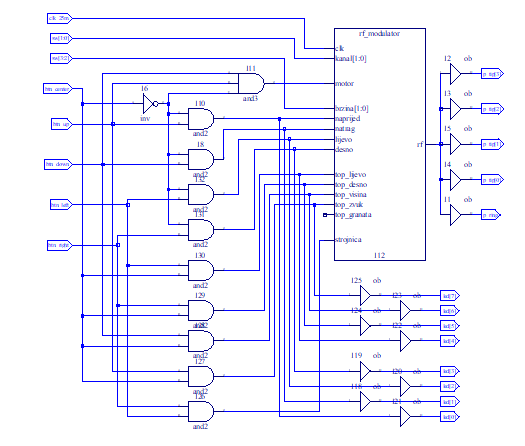
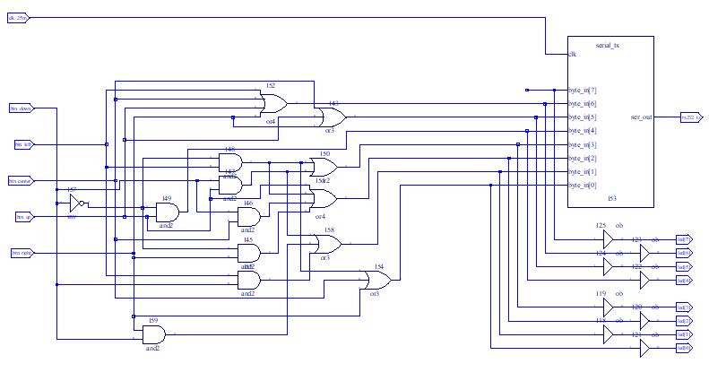

# [CRO] Digitalna logika - laboratorijske vježbe

Repozitorij sadrži laboratorijske vježbe 1. semestra 2020./2021. godine. Vježbe su rađene u programu Lattice Diamond te su programirane na FPGA pločicu FER-ULX2S LFXP2-8E. 
### 1. Laboratorijska vježba 
 -  Vježba za upoznavanje rada programa nadopunjavanjem schematskih sklopova te upravljanja tenka. Svaki gumb bi imao neku svoju funkcionalnost, a neke od njih su paljenje/gašenje motora, okretanje kupole, vožnja u svim smjerovima, emitiranje mitraljeza i ispaljivanja granate

### 2. Laboratorijska vježba
- Crtanje schematskih sklopova tako da pritiskom na određeni gumb se prikaže slovo imena/prezimena. Npr. na lijevi gumb bi se postavio određeni ASCII kod te se pritiskom na njega prikazuje slovo koje predstavlja taj ASCII kod
 

### 3. Laboratorijska vježba 
- Izrada 2. laboratorijske vježbe u jeziku VHDL. Funkcionalnost je identična, samo što se umjesto odrađivanja Booleovih funkcija ne koristi schema nego jezik VHDL
### 4. Laboratorijska vježba 
- Opisivanje temeljnih memorijskih elemenata jezikom VHDL kroz primjere povezivanja sinkronih, bridom okidanih registara i kombinacijske logike u jednostavne sekvencijske sklopove - brojila
- LED lampice na pločici bi se uvećavale za broj koji bi mogli odrediti pomoću 4 prekidača (raspon 1-16)
- Jedan gumb bi povećao registar brojila za n brojeva
- Jedan gumb bi resetirao brojilo na 0
### 5. Laboratorijska vježba 

# [EN] Digital Logic - Laboratory Exercises

### 1. Laboratory Exercise
### 2. Laboratory Exercise
### 3. Laboratory Exercise
### 4. Laboratory Exercise
### 5. Laboratory Exercise
