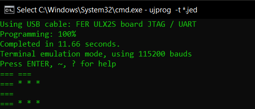

# [CRO] Digitalna logika - laboratorijske vježbe

Repozitorij sadrži laboratorijske vježbe 1. semestra Fakulteta elektrotehnike i računarstva (FER) 2020./2021. godine. Vježbe su rađene u programu Lattice Diamond te su programirane na FPGA pločicu FER-ULX2S LFXP2-8E. 

### 1. Laboratorijska vježba 
 -  Vježba za upoznavanje rada programa nadopunjavanjem shematskih sklopova te upravljanja tenka
 - Svaki gumb bi imao neku svoju funkcionalnost, a neke od njih su paljenje/gašenje motora, okretanje kupole, vožnja u svim smjerovima, emitiranje mitraljeza i ispaljivanja granate

### 2. Laboratorijska vježba

- Crtanje shematskih sklopova tako da pritiskom na određeni gumb se prikaže slovo imena/prezimena. Npr. na lijevi gumb bi se postavio određeni ASCII kod te se pritiskom na njega prikazuje slovo koje predstavlja taj ASCII kod
 
 

### 3. Laboratorijska vježba 

- Izrada 2. laboratorijske vježbe u jeziku VHDL. Funkcionalnost je identična, samo što se umjesto odrađivanja Booleovih funkcija ne koristi shema nego jezik VHDL
 
### 4. Laboratorijska vježba 

- Opisivanje temeljnih memorijskih elemenata jezikom VHDL kroz primjere povezivanja sinkronih, bridom okidanih registara i kombinacijske logike u jednostavne sekvencijske sklopove - brojila
- LED lampice na pločici bi se "uvećavale" za broj koji bi mogli odrediti pomoću 4 prekidača (raspon 1-16)
- Jedan gumb bi povećao registar brojila za n brojeva
- Jedan gumb bi resetirao brojilo na 0

### 5. Laboratorijska vježba 

- Konstruiranje Mooreovog modela automata s konačnim brojem stanja koji zavisno od pobude generira dva odabrana Morseova znaka (MB)
- Koriste se dva bridom okidana registra od kojih glavni određuje trenutno stanje automata, a pomoćni služi kao brojilo ciklusa takta kojim se određuje vremensko trajanje zadržavanja automata u pojedinom stanju
- Osigurana je neosjetljivost sklopa za vrijeme odašiljanja znakova, gumb za prekid, pauza između zadržavanja visoke razine ulaza tijekom odašiljanja znakova

# [EN] Digital Logic - Laboratory Exercises

The repository contains laboratory exercises for the first semester of Faculty of Engineering and Computing (FER) 2020./2021. The exercises were done in Lattice Diamond program and were programmed on FPGA board called FER-ULX2S LFXP2-8E

### 1. Laboratory Exercise
- Exercises to get familiar with the work of the Lattice Diamond by replenishing the scheme assembly for instructions to drive a tank
- Every button on the board would have it's own functionality, and some of them are toggling the ignition, turret rotation, driving in all directions, imitation of machine gun and firing grenades

### 2. Laboratory Exercise

- Drawing schematic assemblies so that combination of buttons can give a letter of name/surname. For example, a specific ASCII code would be placed on button left and pressing it would show a letter representing the ASCII code
 
 
 
### 3. Laboratory Exercise

- Rewriting second laboratory exercises in VHDL language. The functionality is identical, except that instead of using scheme for Boolean functions, VHDL is used.

### 4. Laboratory Exercise

- Describing basic memory elements in VHDL through examples of connecting synchronous, edge-triggered registers and combinational logic into simple sequential circuits - counters
- The LEDs on the board would be "magnified" by a number that could be determined using 4 switches (range 1-16)
- One button would increase the counter register by n numbers
- One button would reset the counter to 0

### 5. Laboratory Exercise
- Constructing a Moore model of an automaton with a finite number of states that depends on the excitation generates two selected Morse characters (MB)
- Two edge-triggered registers are used, the main one of which determines the current state of the automaton, and the auxiliary one serves as a clock cycle counter which determines the time duration of the automaton's retention in a particular state.
- Insensitivity of the circuit during transmission of characters is provided, interrupt button, pause between keeping high input levels during transmission of characters
